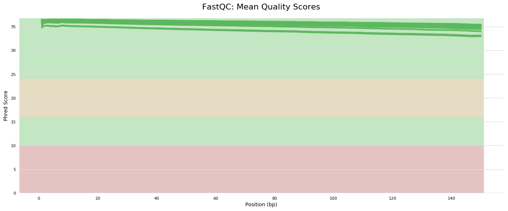
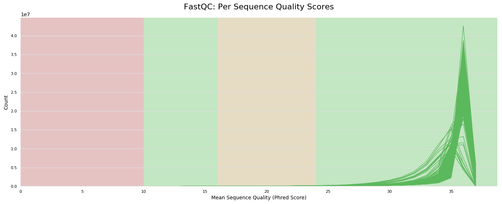
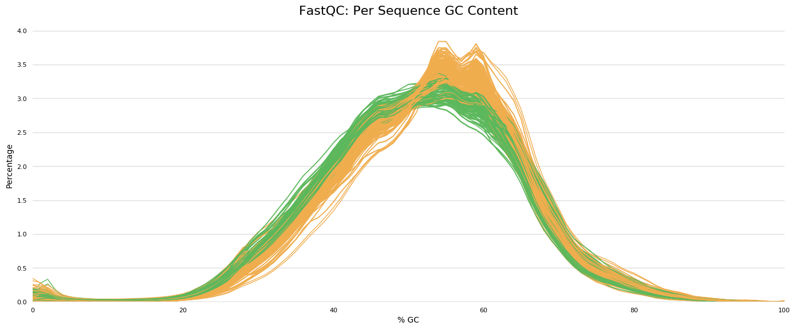
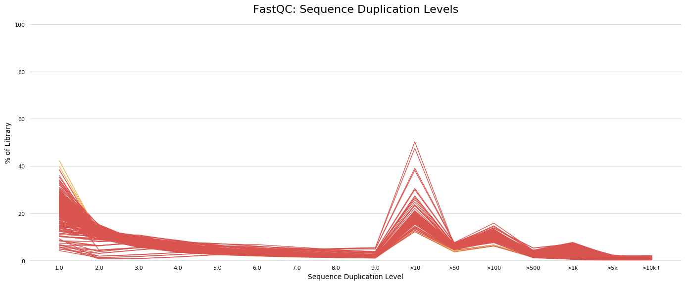
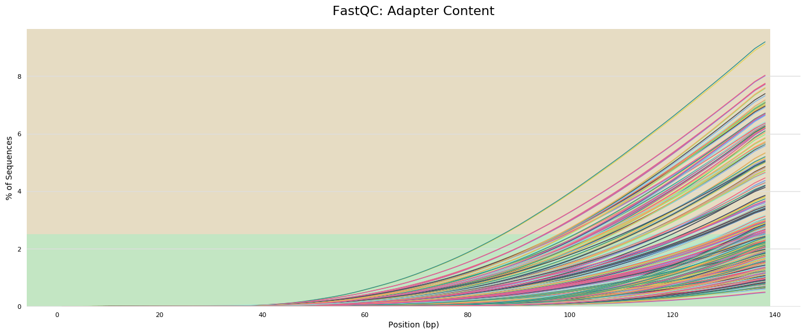

```{r setup, include=FALSE}
knitr::opts_chunk$set(echo = TRUE)
```


## Descripción del equipo

- **Equipo:** numero de equipo
- **Integrantes:** Nombres completos y nombre del usuario en el cluster, 
    + ejemplo: Evelia Lorena Coss-Navarrete (ecoss)
- **Correos electrónicos de los integrantes**

## Descripción de los datos

```{r metadata, echo=FALSE}
# Crear los datos de la tabla
data <- data.frame(
  Descripción = c(
    "Bioproject",
    "Especie",
    "Tipo de bibliotecas",
    "Método de selección",
    "Número de transcriptomas",
    "Número de réplicas biológicas",
    "Secuenciador empleado",
    "Profundidad de secuenciación de cada transcriptoma",
    "Tamaño de las lecturas",
    "Artículo científico"
  ),
  Información = c(
    '[PRJNA1051620](https://www.ncbi.nlm.nih.gov/geo/query/acc.cgi?acc=GSE250023)', 
    '*Homo sapiens*', 
    '*paired-end*', 
    'RNA total', 
    '6', 
    '3 réplicas biológicas por condición (SLE_R y SLE_NR)', 
    'DNBSEQ-G400 platform', 
    '33 M seq a 66 M seq', 
    '150 bp', 
    '[Kavita, *et al*. 2024. Impaired innate and adaptive immune responses to BNT162b2 SARS-CoV-2 vaccination in systemic lupus erythematosus. *JCIinsight*](https://insight.jci.org/articles/view/176556)'
  )
)

# Mostrar la tabla en formato sencillo
knitr::kable(data, 
             caption = "Tabla 1: Detalles del Bioproyecto y características de las muestras")

```


El articulo de "Impaired innate and adaptive immune responses to BNT162b2 SARS-CoV-2 vaccination in systemic lupus erythematosus" analiza las respuestas inmunitarias innatas y adaptativas a la vacunación contra COVID-19 en pacientes con lupus eritematoso sistémico (SLE) comparados con un grupo de control de personas sanas. El estudio clasifica las respuestas de los pacientes en dos grupos: "Respuesta (R, SLE_R)" y "Sin Respuesta (NR, SLE_NR)", teniendo en cuenta tanto la efectividad de la respuesta inmunitaria a la vacunación como la presencia de autoanticuerpos específicos, como los anti-Ro52 y anti-Ro60.

Para fines de esta práctica, se seleccionaron las muestras correspondientes al **día 7** posterior a la vacunación contra COVID-19 (BNT162b2 SARS-CoV-2) en pacientes con lupus, las cuales se presentan en la **Tabla 2**.

```{r tables-data, echo=FALSE, message=FALSE, warning=FALSE}
library(dplyr)
metadata_db <- data.frame(
  individuos = c(rep(1,2), rep(8,2), rep(14, 2), rep(12, 2), rep(17, 2), rep(18,2)),
  muestras = c("S001", "S003", "S006", "S008", "S016", "S018", "S011", "S013", "S021", "S023", "S026", "S028"),
  condicion = c(rep("SLE_R", 6), rep("SLE_NR", 6)),
  respuesta = c(rep("R", 6), rep("NR", 6)),
  tiempos = c(rep(c(0, 7), 6)),
  BioSample = c("SAMN38793003", "SAMN38793001", "SAMN38792999", "SAMN38792997", "SAMN38792990", "SAMN38792988", "SAMN38792994", "SAMN38792993", "SAMN38792985", "SAMN38792983", "SAMN38792980", "SAMN38792978")
)

# filter 
DT::datatable(
  metadata_db %>% 
     filter(tiempos == 7) %>% # filtrar tiempos
     mutate(replica_biologica = c("SLE_R_1", "SLE_R_2", "SLE_R_3", "SLE_NR_1","SLE_NR_2", "SLE_NR_3")), # agregar replicas biologicas
  rownames = FALSE,
  caption = 'Tabla 2. Distribución de las muestras y réplicas biológicas',
  fillContainer = FALSE, options = list(pageLength = 6) 
)

```

Los datos se pueden descargar usando [ENA](https://www.ebi.ac.uk/ena/browser/view/PRJNA1051620).


## Calidad de las secuencias de los datos crudos

> NOTA: Las siguientes figuras son solo representaciones, no son los resultados de este estudio.

Se analizó la calidad de las secuencias en los datos crudos, obteniendo un contenido de GC de aproximadamente 50% y una profundidad de lectura en un rango de 33 M a 66 M secuencias.

Las muestras presentan una calidad óptima, con valores dentro de la zona verde y un puntaje Phred superior a 30. Del mismo modo, las muestras mostraron un promedio de calidad con un pico máximo en Phred 35.

```{r, echo=FALSE, out.width='45%', fig.align='center', fig.show='hold', fig.cap="Calidad de las secuencias en muestras SLE y controles"}


```

Se identificaron varios picos en el %GC lo cual puede relacionarse con contaminacion en las muestras.

```{r, echo=FALSE, out.width='80%', fig.align='center', fig.cap="Variaciones en el porcentaje de %GC en las muestras"}

```

Se identificaron secuencias duplicadas, posiblemente relacionadas con la presencia de dimeros de adaptadores.

```{r, echo=FALSE, out.width='45%', fig.align='center', fig.show='hold', fig.cap="Calidad de las secuencias en muestras SLE"}


```

## Conclusión

Los resultados del análisis de calidad muestran que los datos son adecuados para continuar con el procesamiento y análisis posterior. Las secuencias tienen una buena calidad general, con valores de Phred superiores a 30 y un contenido de GC apropiado. Aunque se observa presencia de contaminación, esta será eliminada después del alineamiento. Solo es necesario eliminar las secuencias de rRNA y los adaptadores para optimizar la limpieza de los datos antes de proceder con el análisis final.