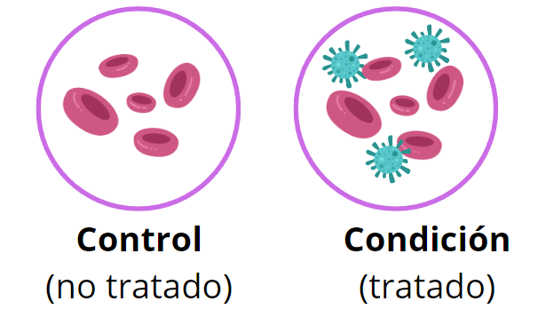
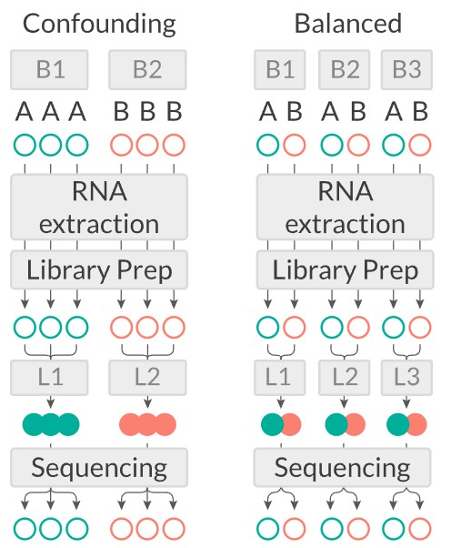
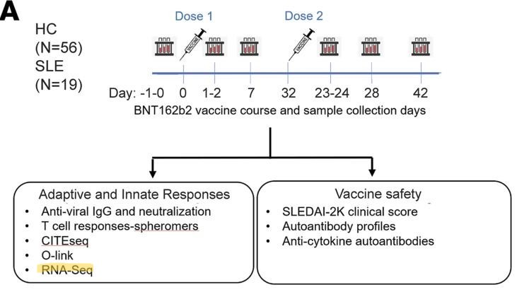
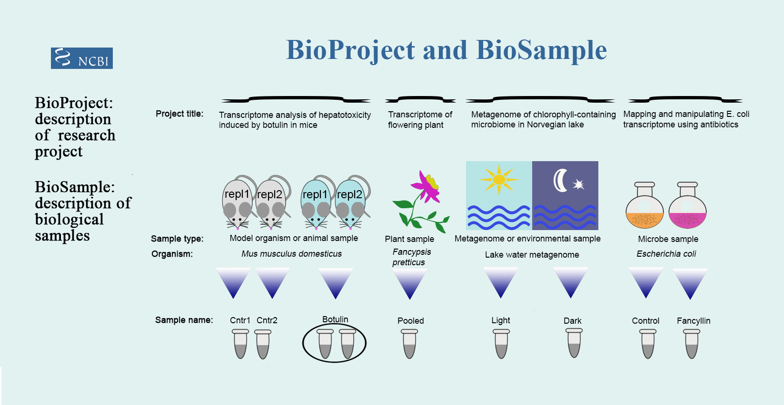
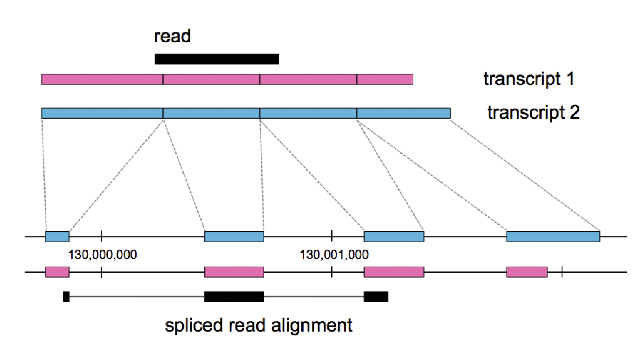
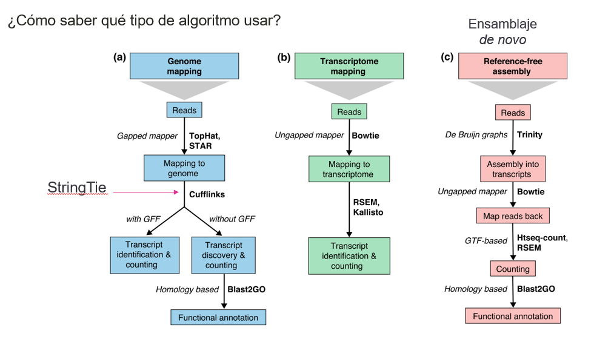
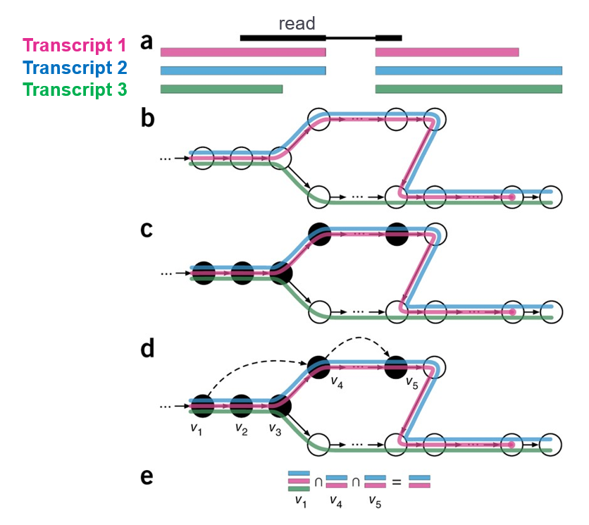
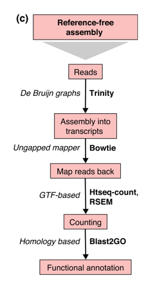
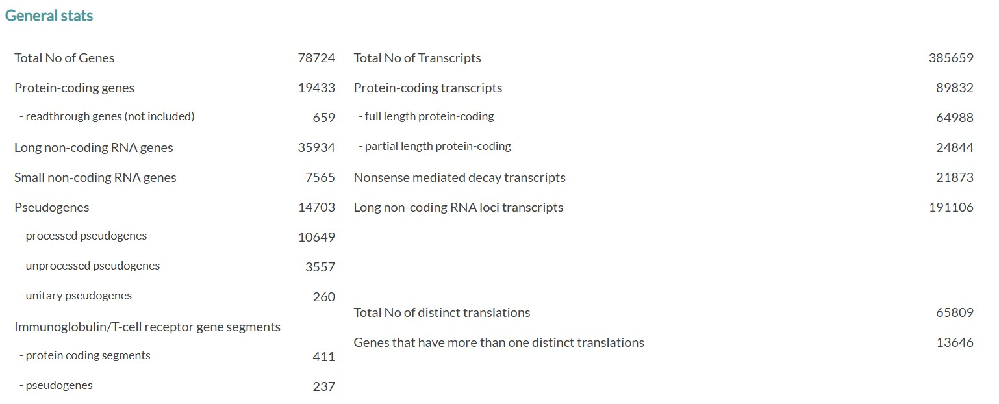

```{r setup, include = FALSE}
# Setup chunk
# Paquetes a usar
#options(htmltools.dir.version = FALSE) cambia la forma de incluir código, los colores

library(knitr)
library(tidyverse)
library(xaringanExtra)
library(icons)
library(fontawesome)
library(emo)
library(countdown) # remotes::install_github("gadenbuie/countdown", subdir = "r")

# set default options
opts_chunk$set(collapse = TRUE,
               dpi = 300,
               warning = FALSE,
               error = FALSE,
               comment = "#")

top_icon = function(x) {
  icons::icon_style(
    icons::fontawesome(x),
    position = "fixed", top = 10, right = 10
  )
}

knit_engines$set("yaml", "markdown")

# Con la tecla "O" permite ver todas las diapositivas
xaringanExtra::use_tile_view()
# Agrega el boton de copiar los códigos de los chunks
xaringanExtra::use_clipboard()

# Crea paneles impresionantes 
xaringanExtra::use_panelset()

# Para compartir e incrustar en otro sitio web
xaringanExtra::use_share_again()
xaringanExtra::style_share_again(
  share_buttons = c("twitter", "linkedin")
)

# Funcionalidades de los chunks, pone un triangulito junto a la línea que se señala
xaringanExtra::use_extra_styles(
  hover_code_line = TRUE,         #<<
  mute_unhighlighted_code = TRUE  #<<
)

# Agregar web cam
xaringanExtra::use_webcam()
```

```{r xaringan-editable, echo=FALSE}
# Para tener opciones para hacer editable algun chunk
xaringanExtra::use_editable(expires = 1)
# Para hacer que aparezca el lápiz y goma
xaringanExtra::use_scribble()
```


```{r xaringan-themer Eve, include=FALSE, warning=FALSE}
# Establecer colores para el tema
library(xaringanthemer)

palette <- c(
 orange        = "#fb5607",
 pink          = "#ff006e",
 blue_violet   = "#8338ec",
 zomp          = "#38A88E",
 shadow        = "#87826E",
 blue          = "#1381B0",
 yellow_orange = "#FF961C"
  )

#style_xaringan(
style_duo_accent(
  background_color = "#FFFFFF", # color del fondo
  link_color = "#562457", # color de los links
  text_bold_color = "#0072CE",
  primary_color = "#01002B", # Color 1
  secondary_color = "#CB6CE6", # Color 2
  inverse_background_color = "#00B7FF", # Color de fondo secundario 
  colors = palette,
  
  # Tipos de letra
  header_font_google = google_font("Barlow Condensed", "600"), #titulo
  text_font_google   = google_font("Work Sans", "300", "300i"), #texto
  code_font_google   = google_font("IBM Plex Mono") #codigo
  #text_font_size = "1.5rem" # Tamano de letra
)
# https://www.rdocumentation.org/packages/xaringanthemer/versions/0.3.4/topics/style_duo_accent
```

class: title-slide, middle, center
background-image: url(figures/Clases_RNASeq_Slide1.png) 
background-position: 90% 75%, 75% 75%, center
background-size: 1210px,210px, cover

.center-column[
# `r rmarkdown::metadata$title`
### `r rmarkdown::metadata$subtitle`

####`r rmarkdown::metadata$author` 
#### `r rmarkdown::metadata$date`
]

.left[.footnote[R-Ladies Theme[R-Ladies Theme](https://www.apreshill.com/project/rladies-xaringan/)]]

---

# Repaso 

.pull-left[

### Contraste

```{r, echo=FALSE, out.width='80%', fig.align='center', fig.pos='top'}

```
]


.pull-right[

### Diseño experimental

```{r, echo=FALSE, out.width='50%', fig.align='center', fig.pos='top'}

```
]

.left[.footnote[.black[
Figura obtenida del [NBIS SciLifeLab](https://scilifelab.github.io/courses/ngsintro/1910/slides/rnaseq/presentation.html#6)
]]]

---

## Pipeline bioinformática para RNA-seq

.pull-right[
```{r, echo=FALSE, out.width='80%', fig.align='center', fig.pos='top'}
knitr::include_graphics("figures/pipeline1.png")
```
]

.left[.footnote[.black[
Imagen proveniente de [mRNA-Seq data analysis workflow](https://biocorecrg.github.io/RNAseq_course_2019/workflow.html)
]]]

---
# Contenido de la clase


- 1) Descarga de datos públicos de RNA-seq con `wget`

- 2) Análisis de control de calidad de lecturas

- 3) Trimming

- 4) Alineamiento con el genoma de referencia mediante STAR

---

class: inverse, center, middle

`r fontawesome::fa("folder-open", height = "3em")`
# 1. Descarga de datos públicos de RNA-seq

---
### ¿Cómo podemos conseguir datos públicos de RNA-seq?

La forma más simple es ir a repositorios de datos públicos, como [GEO (Gene Expression Omnibus)](https://www.ncbi.nlm.nih.gov/geo/), en donde encontraremos los archivos de datos **crudos** y a veces también las **matrices de cuentas ya procesadas** ó a [Recount3](https://rna.recount.bio/) (aquí podemos encontrar datos ya procesados).

**Para esta clase, usaremos las muestras del estudio [GSE250023](https://www.ncbi.nlm.nih.gov/geo/query/acc.cgi?acc=GSE250023)** provenientes de [Kavita, *et al*. 2024. *JCIinsight*](https://insight.jci.org/articles/view/176556).

- Bioproject: PRJNA1051620, [NIH](https://www.ncbi.nlm.nih.gov/bioproject/PRJNA1051620) y [EBI](https://www.ebi.ac.uk/ena/browser/view/PRJNA1051620)

```{r, echo=FALSE, out.width='50%', fig.align='center', fig.pos='top'}

```


---

### Descarga de los datos con `wget`

.pull-left[
1. Selecciona el estudio que vas a utilizar.
2. Ingresa a la página de [EBI](https://www.ebi.ac.uk/).
3. En el buscador, escribe el ID del estudio y presiona Enter.
4. En los resultados, ubica la sección **"Nucleotide sequences"** y selecciona el estudio correspondiente.
5. En la tabla inferior, dirígete a la columna **"Generated FASTQ files: FTP"**.
6. Selecciona las muestras que deseas descargar.
7. Haz clic izquierdo en **"Get download script"** para obtener el script de descarga.
]

.pull-right[
```{r, echo=FALSE, out.width='80%', fig.align='center', fig.pos='top'}
knitr::include_graphics("figures/leer.jpg")
```
]

---

### Bioproject, Biosample y SRA

En pocas palabras, **SRA contiene los datos crudos de secuenciación** obtenidos de **muestras biológicas** (BioSamples) dentro de un **estudio** (BioProject).


```{r, echo=FALSE, out.width='80%', fig.align='center', fig.pos='top'}

```

.left[.footnote[.black[
Imagen proveniente de [NCBI](https://www.ncbi.nlm.nih.gov/sra/docs/submitbio/)
]]]

---

### Bioproject: PRJNA1051620

En este proyecto se analizaron **18 pacientes con lupus**, contando con 4 tomas en el tiempo posterior a la **vacunación contra COVID-19 (BNT162b2 SARS-CoV-2)**, lo que resultó en un total de 75 biosamples (SRA Experiments).

Para fines de esta práctica, se seleccionaron aquellas correspondientes al **día 7** posterior a la vacunación contra COVID-19 (BNT162b2 SARS-CoV-2) en pacientes con lupus.

```{r tables-data, echo=FALSE}
library(dplyr)
metadata_db <- data.frame(
  individual = c(rep(1,2), rep(8,2), rep(14, 2), rep(12, 2), rep(17, 2), rep(18,2)),
  sample = c("S001", "S003", "S006", "S008", "S016", "S018", "S011", "S013", "S021", "S023", "S026", "S028"),
  condition = c(rep("SLE_R", 6), rep("SLE_NR", 6)),
  reponder = c(rep("R", 6), rep("NR", 6)),
  timepoint = c(rep(c(0, 7), 6)),
  timelabel = c(rep(c("d0", "d7"), 6)),
  identifiers = c("p1.S001.day0", "p1.S003.day7", "p8.S006.day0", "p8.S008.day7", "p14.S016.day0", "p14.S018.day7", "p12.S011.day0", "p12.S013.day7", "p17.S021.day0", "p17.S023.day7", "p18.S026.day0", "p18.S028.day7"),
  BioSample = c("SAMN38793003", "SAMN38793001", "SAMN38792999", "SAMN38792997", "SAMN38792990", "SAMN38792988", "SAMN38792994", "SAMN38792993", "SAMN38792985", "SAMN38792983", "SAMN38792980", "SAMN38792978")
)

# filter 
DT::datatable(
  metadata_db %>% filter(timepoint == 7), caption = 'Información de la metadata',
  fillContainer = FALSE, options = list(pageLength = 8)
)
```


---

### Descarga de los datos con `wget`

Esto descargará un script BASH `.sh` como [este](https://github.com/EveliaCoss/RNAseq_classFEB2025/blob/main/Practica_Dia2/scripts/PRJNA1051620_download.sh), el cual utilizar para descargar las muestras.

Para correr este script y descargar las muestras, debemos ir a la carpeta donde las queremos guardar y ahí guardamos el script. Supongamos que yo renombré mi script a [`PRJNA1051620_download.sh`](https://github.com/EveliaCoss/RNAseq_classFEB2025/blob/main/Practica_Dia2/scripts/PRJNA1051620_download.sh). Y lo tengo en una carpeta llamada `scripts`.

```{bash, eval = F}
cd /mnt/atgc-d1/bioinfoII/rnaseq/BioProject_2025/Practica/scripts/
```

> NOTA: Recuerda darle permisos a tus compañer@s:

```{bash, eval=F}
setfacl -R -m u:usuario:rwx CARPETA
```

---

### Descarga de los datos con `wget`

Ya que las descargas tardan mucho, es conveniente enviar el script a la cola de ejecución usando **Sun Grid Engine (SGE)** con un archivo .sge. De esta manera, el script seguirá ejecutándose aunque tú no estés. 

Es necesario tener un solo script donde todos los datos se descargue. 

  - Ejemplo: [download_all_rawData.sge](https://github.com/EveliaCoss/RNAseq_classFEB2025/blob/main/Practica_Dia2/scripts/download_all_rawData.sge)

---

## NO se trabaja en el **nodo principal**

📢 **Regla importante:** ¡No trabajes directamente en el nodo principal del clúster!

🚫 **No ejecutes scripts pesados ni análisis directamente en el nodo de acceso.**

✔️ **Siempre usa el sistema de colas (SGE)** para enviar trabajos o solicita un nodo de prueba si necesitas ejecutar algo interactivo. Usa `qsub` para enviar trabajos.

Si necesitas hacer pruebas o ejecutar código interactivamente, solicita un nodo de prueba con `qlogin` o `qsub -I`.

```{bash, eval=F}
qlogin # pedir un nodo de prueba, default = 2GB
qlogin -pe smp 4 -l h_vmem=16G
```


`qlogin`:	Solicita un nodo interactivo en el clúster (para probar código en tiempo real). `-pe smp 4`:	Pide 4 núcleos (CPUs) en el entorno paralelo smp (Shared Memory Processing). `-l h_vmem=16G`:	Asigna 16 GB de memoria RAM por núcleo (en total, 4 × 16 GB = 64 GB de RAM para el trabajo).

Para salir del nodo interactivo, usa:

```{bash, eval=F}
exit
```

---

class: inverse, center, middle

`r fontawesome::fa("laptop-code", height = "3em")`
# 2. Análisis de control de calidad

---
# 1. Análisis de control de calidad de lecturas

Para hacer el análisis de control de calidad **QC**. Utilizaremos los programas `fastqc` y `multiqc`

### 1. Fastqc 

Este programa va a realizar un análisis de control de calidad en cada una de los archivos `.fastq.gz` y nos va a dar un reporte en forma de un archivo tipo `.html`. 

Para más información visita la pagina https://www.bioinformatics.babraham.ac.uk/projects/fastqc/.

### 2. Multiqc

Este programa toma todos los archivos `.html` que arrojó `fastqc` y nos dará un reporte combinado de todas las muestras.

Para más información visita la pagina https://multiqc.info/docs/getting_started/installation/

---

### Correr `fastqc`

Vamos a analizar el contenido del script `qc1.sge`:

```{bash, eval = F}
# Add any modules you might require:
#
module load fastqc/0.11.3
module load multiqc/1.5
#
# Write your commands in the next line
# FastQC analysis
for file in /mnt/atgc-d1/bioinfoII/rnaseq/BioProject_2025/Practica/data/*.fastq.gz; do fastqc $file -o /mnt/atgc-d1/bioinfoII/rnaseq/BioProject_2025/Practica/quality1; done
```

Para analizar  **todos los archivos** que tengan terminación `.fastq.gz` podemos emplear un `for loop`:

```{bash, eval = F}
for file in data/*.fastq.gz; do fastqc $file -o quality1; done
```

El comando para correr `fastqc` en **un solo archivo** es:

```{bash, eval = F}
fastqc nombre.fastq.gz -o /directorio/de/salida
```

---

## Analicemos el output de `fastQC`

Veamos la información contenida en el [`SRR12363092_1_fastqc.html`](https://eveliacoss.github.io/RNAseq_classFEB2025/Practica_Dia2/FastQC_Reports/SRR12363092_1_fastqc.html).

---
## Pausa: Mi carpeta se ve (más o menos) así:

```{bash, eval = F}
/mnt/atgc-d1/bioinfoII/rnaseq/BioProject_2025/Practica/
├── data/
│   ├── SRR12363092_1.fastq.gz
│   ├── SRR12363092_2.fastq.gz
│   ├── SRR12363093_1.fastq.gz
│   ├── SRR12363093_2.fastq.gz
...
├── quality1/
│   ├── SRR12363092_1_fastqc.html
│   ├── SRR12363092_1_fastqc.zip
│   ├── SRR12363092_2_fastqc.html
├── scripts/
...
```

Mira [aquí](https://github.com/EveliaCoss/RNASeq_Workshop_Nov2023/blob/main/Dia2_Alineamiento/out_logs/qc1.o369176) cómo se ve la ejecución de este comando.

---

### Correr `multiqc`

Multiqc reconoce los outputs de `fastqc` por lo que el comando para utilizarlo es muy sencillo

```{bash, eval = F}
cd /mnt/atgc-d1/bioinfoII/rnaseq/BioProject_2025/Practica/quality1
multiqc .
```

> **NOTA:** siempre es mejor utilizar direcciones absolutas a relativas, para evitar que tus outputs se guarden en un directorio no deseado.

```{bash, eval = F}
multiqc /mnt/atgc-d1/bioinfoII/rnaseq/BioProject_2025/Practica/quality1/
```

---

## Script y ejecución en el cluster

Si desean ver como se analizaron los datos empleando los programas `FastQC` y `multiQC` dentro del cluster DNA, les dejo el siguiente script:

  - [`qc1.sge`](https://github.com/EveliaCoss/RNAseq_classFEB2025/blob/main/Practica_Dia2/scripts/qc1.sge)

Mira [aquí](https://github.com/EveliaCoss/RNAseq_classFEB2025/blob/main/Practica_Dia2/out_logs/qc1.o369176) la salida del programa.

---

## Analicemos el output de `multiqc`

Veamos la informacion contenida en el [`multiqc_report.html`](https://eveliacoss.github.io/RNAseq_classFEB2025/Practica_Dia2/FastQC_Reports/multiqc_report.html).

---

class: inverse, center, middle

`r fontawesome::fa("filter", height = "3em")`
# 3. Trimming
### Remover adaptadores y secuencias de mala calidad 

---

## Trimming

Para hacer **trimming** de las lecturas que no tuvieron una buena calidad, utilizaremos la herramienta `trimmomatic`. Este programa tiene muchas opciones que nos permiten hacer trimming de formas distintas, aquí muestro el comando que utilizaremos para nuestras necesidades. Pero asegúrate de leer el [manual](http://www.usadellab.org/cms/uploads/supplementary/Trimmomatic/TrimmomaticManual_V0.32.pdf) para tus análisis personales.


**Para paired-end necesitamos:**

- Las dos lecturas paired end por muestra: `SRRxxxxx_1.fastq.gz` y `SRRxxxx_2.fastq.gz`
- Un archivo con los adaptadores que vamos a cortar: `TruSeq3-PE-2.fa`

Descarga los adaptadores de [aquí](https://github.com/timflutre/trimmomatic/blob/master/adapters/TruSeq3-PE-2.fa)

```{bash, eval = F}
cd /mnt/atgc-d1/bioinfoII/rnaseq/BioProject_2025
# Paired-end
wget https://raw.githubusercontent.com/timflutre/trimmomatic/master/adapters/TruSeq3-PE-2.fa
# single-end
wget https://raw.githubusercontent.com/timflutre/trimmomatic/master/adapters/TruSeq3-SE.fa
```

---

## Correr Trimmomatic

Creamos una carpeta para los resultados

```{bash, eval = F}
mkdir TRIM_results
```

Usamos un `for loop` para hacer trimmomatic a cada par de lecturas `SRRxxxxx_1.fastq.gz` y `SRRxxxx_2.fastq.gz`

```{bash, eval = F}
module load trimmomatic/0.33
cd /mnt/atgc-d1/bioinfoII/rnaseq/BioProject_2025/Practica/data
for i in *_1.fastq.gz;
do echo
trimmomatic PE -threads 8 -phred33 $i "${i%_1.fastq.gz}_2.fastq.gz" \
/mnt/atgc-d1/bioinfoII/rnaseq/BioProject_2025/Practica/"${i%_1.fastq.gz}_1_trimmed.fq.gz" \
/mnt/atgc-d1/bioinfoII/rnaseq/BioProject_2025/Practica/"${i%_1.fastq.gz}_1_unpaired.fq.gz" \
/mnt/atgc-d1/bioinfoII/rnaseq/BioProject_2025/Practica/"${i%_1.fastq.gz}_2_trimmed.fq.gz" \
/mnt/atgc-d1/bioinfoII/rnaseq/BioProject_2025/Practica/"${i%_1.fastq.gz}_2_unpaired.fq.gz" \
ILLUMINACLIP:/mnt/atgc-d1/bioinfoII/rnaseq/BioProject_2025/TruSeq3-PE-2.fa:2:30:10 LEADING:3 TRAILING:3 SLIDINGWINDOW:4:20 MINLEN:80 \

done
```

---
### Trimmomatic
## Salida

Trimmomatic nos dará 4 outputs: Las secuencias que quedaron sin par que eran originalmente del archivo "1": `_1_unpaired.fastq.gz`, las secuencias sin par que eran del archivo "2": `_2_unpaired.fastq.gz` y las secuencias que aun están pareadas: `_1_trimmed.fastq.gz` y `_2_trimmed.fastq.gz`.

---

### Trimmomatic
## Documentación de las opciones

```{bash, eval= F}
ILLUMINACLIP:/mnt/atgc-d1/bioinfoII/rnaseq/BioProject_2025/TruSeq3-PE-2.fa:2:30:10 LEADING:3 TRAILING:3 SLIDINGWINDOW:4:20 MINLEN:80
```

ILLUMINACLIP:`<fastaWithAdaptersEtc>:<seed mismatches>:<palindrome clip threshold>:<simple clip threshold>`

- Recorta adaptadores de las lecturas usando el archivo de secuencias de adaptadores especificado.
- `fastaWithAdaptersEtc`: Archivo de adaptadores
- `seed mismatches`: número máximo de desajustes permitidos entre la secuencia de adaptador y la lectura.
- `palindrome clip threshold`: umbral para considerar una coincidencia con el adaptador.
- `simple clip threshold`: tamaño de la ventana para evaluar coincidencias con adaptadores.

LEADING:`<quality>`

- Recorta bases al inicio de la lectura si tienen una calidad menor al valor especificado.
- `quality`: Calidad minima requerida para retener la base.

---

### Trimmomatic
## Documentación de las opciones

```{bash, eval= F}
ILLUMINACLIP:/mnt/atgc-d1/bioinfoII/rnaseq/BioProject_2025/TruSeq3-PE-2.fa:2:30:10 LEADING:3 TRAILING:3 SLIDINGWINDOW:4:20 MINLEN:80
```

TRAILING:`<quality>`

- Recorta bases al final de la lectura si tienen una calidad menor al valor especificado.
- `quality`: Calidad minima requerida para retener la base.

SLIDINGWINDOW:`<windowSize>:<requiredQuality>`

- Escanea la lectura con una ventana deslizante de <tamaño_ventana> bases.
- Si el promedio de calidad dentro de la ventana es menor que <calidad>, recorta la lectura desde ese punto.
- `windowSize`: especifica el número de bases que hay que promediar
- `requiredQuality`: especifica la calidad media exigida.

---

### Trimmomatic
## Documentación de las opciones

```{bash, eval= F}
ILLUMINACLIP:/mnt/atgc-d1/bioinfoII/rnaseq/BioProject_2025/TruSeq3-PE-2.fa:2:30:10 LEADING:3 TRAILING:3 SLIDINGWINDOW:4:20 MINLEN:80
```

MINLEN: `MINLEN:<longitud>`
- Descarta lecturas con una longitud menor al valor especificado después del recorte.

Mira [aquí](https://github.com/EveliaCoss/RNAseq_classFEB2025/blob/main/Practica_Dia2/out_logs/trim.o369193) cómo se ve la ejecución de este comando.

---

## QC del Trimming
### ¿Qué tan buena es la calidad después de eliminar adaptadores y secuencias de baja calidad?

Corramos `fastqc` y `multiqc` de nuevo

```{bash, eval = F}
mkdir quality2
for file in /mnt/atgc-d1/bioinfoII/rnaseq/BioProject_2025/TRIM_results/*.fq.gz; do fastqc $file -o /mnt/atgc-d1/bioinfoII/rnaseq/BioProject_2025/quality2; done
```

```{bash, eval = F}
multiqc /mnt/atgc-d1/bioinfoII/rnaseq/BioProject_2025/quality2
```

---

## Script y ejecución en el cluster

Si desean ver como se analizaron los datos empleando los programas `FastQC` y `multiQC` dentro del cluster DNA, les dejo los siguientes scripts:

  - [`qc2.sh`](https://github.com/EveliaCoss/RNAseq_classFEB2025/blob/main/Practica_Dia2/scripts/qc2.sh) 
  - [`qc2.sge`](https://github.com/EveliaCoss/RNAseq_classFEB2025/blob/main/Practica_Dia2/scripts/qc1.sge)

---

### Pausa: Mi carpeta se ve (más o menos) así:

```{bash, eval = F}
/mnt/atgc-d1/bioinfoII/rnaseq/BioProject_2025/Practica
├── data
│   ├── SRR12363092_1.fastq.gz
...
├── quality1
│   ├── multiqc_data
│   │   ├── multiqc_data.json
│   │   ...
│   ├── multiqc_report.html
...
├── quality2
│   ├── multiqc_data
│   │   ...
│   ├── SRR12363092_1_trimmed.fq_fastqc.html
│   ├── SRR12363092_1_unpaired.fq_fastqc.html
│   ├── SRR12363092_2_trimmed.fq_fastqc.html
...
├── TRIM_results
│   ├── SRR12363092_1_trimmed.fq.gz
│   ├── SRR12363092_1_unpaired.fq.gz
├── scripts/
```
---

### Analicemos el output del `FastQC` y `multiqc`

Veamos la información contenida en los reportes:

- `FastQC` - [SRR12363092_1_trimmed.fq_fastqc.html](https://eveliacoss.github.io/RNAseq_classFEB2025/Practica_Dia2/FastQC_Reports/SRR12363092_1_trimmed.fq_fastqc.html)

- `multiqc` - [`multiqc_report2.html`](https://eveliacoss.github.io/RNAseq_classFEB2025/Practica_Dia2/FastQC_Reports/multiqc_report2.html).

---

class: inverse, center, middle

`r fontawesome::fa("bars", height = "3em")`
# 4. Alineamiento con el genoma de referencia mediante STAR

---
# Pero antes: ¿Qué es el alineamiento?

La **alineación del genoma** es un proceso bioinformático que consiste alinear las secuencias de ADN o ARN de uno o más genomas. El objetivo principal de la alineación del genoma es identificar *regiones de similitud u homología* entre las secuencias, lo que puede proporcionar información valiosa sobre diversos procesos biológicos, como la identificación de genes, el análisis evolutivo y la anotación funcional.

.center[

]

---

## Existen Diversas formas de alinear en RNA-seq

.center[

]

.left[.footnote[.black[
[Conesa, *et al*, 2016. *Genome Biology*](https://genomebiology.biomedcentral.com/articles/10.1186/s13059-016-0881-8)
]]]

---

## 1. Alineamiento y ensamblaje de lecturas guiado por el **genoma de referencia**

.pull-left[
```{r, echo=FALSE, out.width='60%', fig.align='center'}
knitr::include_graphics("figures/alignment_genoma.png")
```
]

.pull-right[
El alineación del genoma de referencia implica mapear las lecturas de RNA-Seq en un **genoma de referencia** conocido.

- Nos permite identificar y cuantificar la expresión de **genes conocidos** y sus isoformas. Además, podemos anotar nuevos transcritos y genes.

- De preferencia contar con un archivo de anotación (GFF).

- La especie debe tener un genoma de buena calidad.

- Empleado normalmente en un organismo modelo (humano, ratón, *Arabidopsis*, etc.).
]

---

## 2. Ensamblaje de **transcriptoma guiado**

.pull-left[
```{r, echo=FALSE, out.width='60%', fig.align='center'}
knitr::include_graphics("figures/alignment_transcriptoma.png")
```
]

.pull-right[
Las lecturas de RNA-Seq se asignan a un transcriptoma de referencia, que es una colección de transcritos. 

- Veremos expresión de **genes**, pero no isoformas.

- NO hay anotación de nuevos transcritos.

- Si no está en el archivo de anotación (tz2gene/kallisto) no lo veremos.

- Es necesario un archivo de anotación con buena calidad.
]

---

## 2. Ensamblaje de **transcriptoma guiado**

### [**Kallisto**](https://pachterlab.github.io/kallisto/manual)

.pull-left[
- Se basa en la probabilidad de asignación correcta de las lecturas a un transcrito.

- **Pseudoalineamiento**.

- Es rápido.

- Se puede ejecutar el programa desde tu computadora.

- Se basa en los grafos de Brujin Graph (T-DBG) .

- Los Nodos (v1,v2,v3) son *k-mers*.

- Omite pasos redundantes en el T-DBG.

]

.pull-right[
```{r, echo=FALSE, out.width='80%', fig.align='center'}

```
]

Si quieren intentarlo les dejo el curso que di en 2023 - [RNAseq_classFEB2023](https://github.com/EveliaCoss/RNAseq_classFEB2023/tree/main/RNA_seq).

.right[.footnote[
[Bray, *et al*. 2016. *Nature*](https://www.nature.com/articles/nbt.3519)]]

---

## 3. Ensamblaje ***de novo***

.pull-left[
```{r, echo=FALSE, out.width='50%', fig.align='center'}

```
]

.pull-right[
Ideal para una especie con **genoma de mala calidad o sin referencia**, como **organismos NO modelos**, además de si no contamos con un archivo de anotación bueno.

- Es recomendado utilizar lecturas *Paired-end*.
]

---

## En esta clase utilizaremos el software de alineamiento **STAR**, de tipo alineamiento a **genoma de referencia**

#### Seguiremos 2 sencillos pasos

1. Indexar el genoma de referencia creando un índice de STAR

2. Alinear y contar con STAR

[Manual de STAR](https://github.com/alexdobin/STAR/blob/master/doc/STARmanual.pdf)

**STAR** nos permite, además de alinear las lecturas, hacer un conteo en el mismo paso. El paso de conteo, puede ser separado y con otras herramientas, pero en esta clase, te enseñaré la forma sencilla en la que STAR también puede contar.

> **NOTA: Para obtener la matriz de cuentas, NECESITAMOS UN ARCHIVO DE ANOTACIÓN.**

---

## Genoma de referencia

- **Genoma de referencia [GRCh38/hg38](https://www.ncbi.nlm.nih.gov/datasets/genome/GCF_000001405.26/) (Dec 2013) (FASTA)** - Proveniente de NCBI

Este archivo deberá estar contenido en la carpeta `reference/`. Puedes usar el genoma de referencia contenido en el clúster con ayuda de un symlink.

```{bash, eval=FALSE}
ln -s /mnt/Archives/genome/human/GRCh38/UCSC/chromosomes/hg38.fa .
```

> Es mejor crear **enlaces simbólicos (symlinks)** en vez de copiar cada archivo, ya que permite ahorrar mucho espacio en el disco al evitar la multiplicación de copias fisicas en el disco duro del mismo archivo.

---

## ¿Qué es un archivo de anotación?

Un archivo de anotación [**GFF**](https://genome.ucsc.edu/FAQ/FAQformat.html#format3) (General Feature File) o [**GTF**](https://genome.ucsc.edu/FAQ/FAQformat.html#format4) (Gene Transfer Format) es un formato de archivo estándar utilizado en bioinformática para almacenar y representar información genómica y de anotación para diversas características dentro de un *genoma*, como **genes, transcritos, exones y otros elementos genómicos**.

.pull-left[
Utilizaremos el Archivo de anotación de **GENCODEv47** junto con el genoma de referencia para poder encontrar las ubicaciones de genes, transcritos, etc.

- **Archivo de anotación (GTF)** - Proveniente de [GENCODE release v47](https://ftp.ebi.ac.uk/pub/databases/gencode/Gencode_human/release_47/gencode.v47.annotation.gtf.gz)

Podemos encontrar estos archivos en bases de datos genómicas como GENCODE para humanos y ratones [aquí](www.gencodegenes.org).
]

.pull-right[
```{r, echo=FALSE, out.width='60%', fig.align='center'}

```
]

---

## Descargar el archivo de anotación

Pide un nodo de prueba, descarga el archivo de anotación de tu especie y descomprime el archivo. Este ejemplo es para *Homo sapiens*:

```{bash, eval=F}
cd /mnt/atgc-d1/bioinfoII/rnaseq/BioProject_2025/Practica/reference/
wget https://ftp.ebi.ac.uk/pub/databases/gencode/Gencode_human/release_47/gencode.v47.annotation.gtf.gz
# gunzip  /mnt/atgc-d1/bioinfoII/rnaseq/BioProject_2025/Practica/reference/gencode.v47.annotation.gtf.gz
```

---

### GENCODE Release 47: Genes y Transcritos

```{r, echo=FALSE, out.width='80%', fig.align='center', fig.pos='top'}

```

.left[.footnote[.black[
Imagen proveniente de [NCBI](https://www.gencodegenes.org/human/stats_47.html)
]]]

---

## Pausa: Hasta este punto debemos de contar con los siguientes archivos

```{bash, eval = F}
/mnt/atgc-d1/bioinfoII/rnaseq/BioProject_2025/Practica/
├── data/
│   ├── SRR12363092_1.fastq.gz
│   ├── SRR12363092_2.fastq.gz
│   ├── SRR12363093_1.fastq.gz
│   ├── SRR12363093_2.fastq.gz
...
├── reference/
│   ├── hg38.fa # symlink
│   ├── gencode.v47.annotation.gtf.gz # Archivo de anotacion
...
```

---

## ¿Qué es indexar un genoma de referencia?

Es una forma computacional de crear una "estructura de datos" para el genoma de referencia, mediante **índices**, de tal forma que podramos **accesar a las partes del mismo** de una forma más eficiente al alinear. 

El genoma de referencia sirve como plantilla contra la cual se realizan diversos análisis genómicos, como mapeo de lecturas, llamado de variantes y cuantificación de la expresión génica. 

**La indexación mejora la velocidad y la eficiencia de estos análisis** al permitir que el software **ubique y acceda rápidamente** a partes relevantes del genoma.

---

## 1. Crear un índice de STAR

Carguemos el módulo de STAR

```{bash, eval = F}
module load star/2.7.9a
```

Creamos un directorio para guardar el indice

```{bash, eval = F}
mkdir STAR_index
```

El script para crear el indice es el siguiente:

```{bash, eval = F}
STAR --runThreadN 12 \
--runMode genomeGenerate \
--genomeDir /mnt/atgc-d1/bioinfoII/rnaseq/BioProject_2025/STAR_index \
--genomeFastaFiles /mnt/atgc-d1/bioinfoII/rnaseq/BioProject_2025/reference/hg38.fa \
--sjdbGTFfile /mnt/atgc-d1/bioinfoII/rnaseq/BioProject_2025/reference/gencode.v47.annotation.gtf.gz \
--sjdbOverhang 149
```

Entremos al 
[Manual de STAR](https://github.com/alexdobin/STAR/blob/master/doc/STARmanual.pdf) para entender las opciones

---

## Script y ejecución en el cluster

Si desean ver como se analizaron los datos empleando el programa `STAR` para realizar el *index del genoma* dentro del cluster DNA, les dejo los siguientes scripts:

  - [`STAR_index.sh`](https://github.com/EveliaCoss/RNAseq_classFEB2025/blob/main/Practica_Dia2/scripts/STAR_index.sh) 
  - [`index.sge`](https://github.com/EveliaCoss/RNAseq_classFEB2025/blob/main/Practica_Dia2/scripts/index.sge)


Mira [aquí](https://github.com/EveliaCoss/RNAseq_classFEB2025/blob/main/Practica_Dia2/out_logs/index.o369188) cómo se ve la ejecución de este comando.

---

## 2. Alinear y **CONTAR** con STAR

Si revisamos el [Manual de STAR](https://github.com/alexdobin/STAR/blob/master/doc/STARmanual.pdf) notarás que hay una opción para **Contar lecturas por genes** (Sección 8). Con la opción de `--quantMode`. De hecho, estas cuentas coinciden con las cuentas que nos daría `htseq-count`

```{bash, eval = F}
index=/mnt/atgc-d1/bioinfoII/rnaseq/BioProject_2025/STAR_index
FILES=/mnt/atgc-d1/bioinfoII/rnaseq/BioProject_2025/TRIM_results/*_1_trimmed.fq.gz
for f in $FILES
do
    base=$(basename $f _1_trimmed.fq.gz)
    echo $base
    STAR --runThreadN 12 --genomeDir $index --readFilesIn $f /mnt/atgc-d1/bioinfoII/rnaseq/BioProject_2025/TRIM_results/$base"_2_trimmed.fq.gz" \
    --outSAMtype BAM SortedByCoordinate \
    --quantMode GeneCounts \
    --readFilesCommand zcat \
    --outFileNamePrefix /mnt/atgc-d1/bioinfoII/rnaseq/BioProject_2025/STAR_output/$base
done
```

Mira [aquí](https://github.com/EveliaCoss/RNAseq_classFEB2025/blob/main/Practica_Dia2/out_logs/align.o369662) cómo se ve la ejecución de este comando.

---

### SCRIPTS empleados en la clase

Todos los scripts usados en esta clase están en el [GitHub](https://github.com/EveliaCoss/RNAseq_classFEB2025/tree/main/Practica_Dia2/scripts)

---

### Las carpetas contenidas por equipo deberan ser:

```{bash, eval = F}
Equipo1
├── annotation    # Archivo de anotacion del organismo (GFF o GTF)
├── data          # raw Data
├── reference     # Genoma de Referencia o symlink del genoma de referencia (opcional)
├── metadata.csv  # Metadata
├── quality1      # FastQC y multiQC de raw Data
├── quality2      # FastQC y multiQC de los datos despues del Trimming
├── results       # Resultados obtenidos de DEG
├── scripts       # Todos los scripts
├── STAR_index    # Index del genoma de referencia
├── STAR_output   # Salida de STAR, cuentas y BAM
├── TRIM_results  # Salida del Trimming
└── TruSeq3-PE-2.fa # Adaptadores PE de Illumina

```

---

## RNA-seq Nexflow

Se pueden fusionar múltiples programas en un solo flujo de trabajo utilizando **Nextflow**, una herramienta diseñada para la **orquestación y automatización** de pipelines en bioinformática y otras disciplinas computacionales. 

Además, su compatibilidad con **contenedores** (Docker, Singularity) y **sistemas de gestión de colas** (SGE, SLURM) lo convierte en una solución flexible para proyectos complejos que involucran múltiples herramientas y formatos de datos.

```{r, echo=FALSE, out.width='80%', fig.align='center', fig.pos='top'}
knitr::include_graphics("figures/rnaseq_nexflow.png")
```


.left[.footnote[.black[
Imagen proveniente de [nf-core/rnaseq](https://nf-co.re/rnaseq/3.14.0/)
]]]

---

class: inverse, center, middle

`r fontawesome::fa("feather", height = "3em")`
## Tarea para el **Martes 4 de marzo**
### Reporte de calidad de las secuencias crudas

**Subir en la tarea de Google Classroom**

---

### Tarea
## Cada equipo debe entregarme un documento en formato Rmd y HTML que contenga la siguiente información:

- Descripción de los datos (entregable 1, fecha límite: 25 de febrero).
- Explicación de las gráficas generadas por MultiQC.
- Conclusión sobre los datos: 
    + ¿Son viables para continuar con el análisis? 
    + ¿Qué pasos deben seguirse para mejorar la calidad de los datos?

Ejemplo de entregable: [Reporte](https://eveliacoss.github.io/RNAseq_classFEB2025/Entregable_ejemplo2.html)

**Subir en la tarea de Google Classroom**

---

class: center, middle

`r fontawesome::fa("code", height = "3em")`
# Martes 4 de marzo 2025  
## Importar datos en R, Normalización y Corrección por batch
## DEG con DESeq2

Gracias por tu atención, respira y coméntame tus dudas. 
