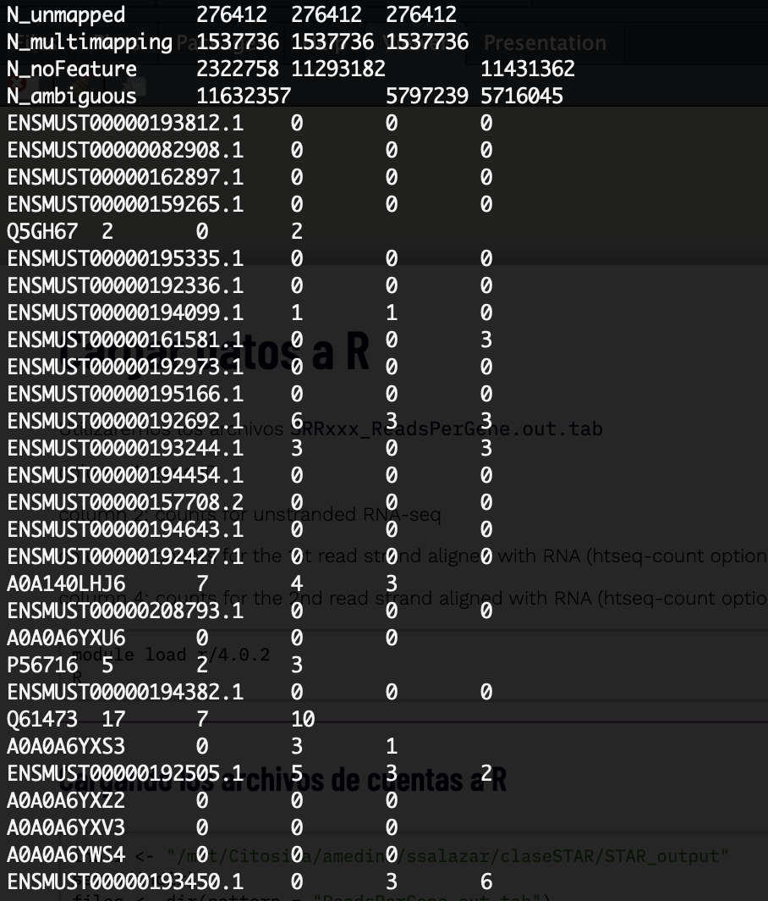

```{r setup, include = FALSE}
# Setup chunk
# Paquetes a usar
#options(htmltools.dir.version = FALSE) cambia la forma de incluir código, los colores

library(knitr)
library(tidyverse)
library(xaringanExtra)
library(icons)
library(fontawesome)
library(emo)

# set default options
opts_chunk$set(collapse = TRUE,
               dpi = 300,
               warning = FALSE,
               error = FALSE,
               comment = "#")

top_icon = function(x) {
  icons::icon_style(
    icons::fontawesome(x),
    position = "fixed", top = 10, right = 10
  )
}

knit_engines$set("yaml", "markdown")

# Con la tecla "O" permite ver todas las diapositivas
xaringanExtra::use_tile_view()
# Agrega el boton de copiar los códigos de los chunks
xaringanExtra::use_clipboard()

# Crea paneles impresionantes 
xaringanExtra::use_panelset()

# Para compartir e incrustar en otro sitio web
xaringanExtra::use_share_again()
xaringanExtra::style_share_again(
  share_buttons = c("twitter", "linkedin")
)

# Funcionalidades de los chunks, pone un triangulito junto a la línea que se señala
xaringanExtra::use_extra_styles(
  hover_code_line = TRUE,         #<<
  mute_unhighlighted_code = TRUE  #<<
)

# Agregar web cam
xaringanExtra::use_webcam()
```

```{r xaringan-editable, echo=FALSE}
# Para tener opciones para hacer editable algun chunk
xaringanExtra::use_editable(expires = 1)
# Para hacer que aparezca el lápiz y goma
xaringanExtra::use_scribble()
```


```{r xaringan-themer Eve, include=FALSE, warning=FALSE}
# Establecer colores para el tema
library(xaringanthemer)

palette <- c(
 orange        = "#fb5607",
 pink          = "#ff006e",
 blue_violet   = "#8338ec",
 zomp          = "#38A88E",
 shadow        = "#87826E",
 blue          = "#1381B0",
 yellow_orange = "#FF961C"
  )

#style_xaringan(
style_duo_accent(
  background_color = "#FFFFFF", # color del fondo
  link_color = "#562457", # color de los links
  text_bold_color = "#0072CE",
  primary_color = "#01002B", # Color 1
  secondary_color = "#CB6CE6", # Color 2
  inverse_background_color = "#00B7FF", # Color de fondo secundario 
  colors = palette,
  
  # Tipos de letra
  header_font_google = google_font("Barlow Condensed", "600"), #titulo
  text_font_google   = google_font("Work Sans", "300", "300i"), #texto
  code_font_google   = google_font("IBM Plex Mono") #codigo
  #text_font_size = "1.5rem" # Tamano de letra
)
# https://www.rdocumentation.org/packages/xaringanthemer/versions/0.3.4/topics/style_duo_accent
```

class: title-slide, middle, center
background-image: url(figures/Clases_RNASeq_Slide1.png) 
background-position: 90% 75%, 75% 75%, center
background-size: 1210px,210px, cover

.center-column[
# `r rmarkdown::metadata$title`
### `r rmarkdown::metadata$subtitle`

####`r rmarkdown::metadata$author` 
#### `r rmarkdown::metadata$date`
]

.left[.footnote[R-Ladies Theme[R-Ladies Theme](https://www.apreshill.com/project/rladies-xaringan/)]]

---

# Contenido de la clase


- 1) Fuentes de error

- 2) Importar datos de STAR a R

- 3) Normalización de los datos

- 4) Detección y corrección por batch effect

- 5) DEG con DESeq2

---

class: inverse, center, middle

`r fontawesome::fa("bug", height = "3em")`
# 1. Fuentes de error

---

# Fuentes de error

Existen dos fuentes principales de error:

- **Error humano:** mezcla de muestras (en el laboratorio o cuando se recibieron los archivos), errores en el protocolo.

- **Error técnico:** Errores inherentes a la plataforma (e.g. secuencias de mononucleótidos en pyrosecuenciacion) –

Todas las plataformas tienen cierto de nivel de error que se debe tomar en cuenta cuando se está diseñando el experimento. 

---
# Errores en preparación de la **muestra**

- **Errores del usuario:** Etiquetado incorrecto de la muestra.

- **Degradación de ADN/ARN:** Causada por métodos inadecuados de preservación o manipulación.

- **Contaminación con secuencias externas:** Introducción de material genético ajeno a la muestra.

- **Baja cantidad de ADN/ARN de inicio:** Insuficiente material genético para una preparación adecuada de la biblioteca.

---

# Errores en preparación de las **bibliotecas**

- **Errores del usuario:** Contaminación entre muestras, contaminación con productos de reacciones previas, fallos en la ejecución del protocolo.

- **Errores de amplificación por PCR:** Introducción de artefactos debido a amplificación ineficiente o excesiva.

- **Sesgo por cebadores (primers):** Incluye sesgo de unión, sesgo por metilación y formación de dímeros de cebadores.

- **Sesgo por captura:** Derivado del uso de estrategias como Poly-A o Ribozero.

- **Errores de la máquina:** Configuración incorrecta del equipo o interrupción de la reacción.

- **Quimeras:** Artefactos generados por recombinación errónea de secuencias durante la amplificación.

- **Errores en índices y adaptadores:** Contaminación con adaptadores, baja diversidad de índices, códigos de barras (barcodes) incompatibles o sobrecarga de muestras.

---

# Errores de **secuenciación**

- **Errores del usuario:** Sobrecarga de la celda de secuenciación.

- **Desfase:** Extensión incompleta de la cadena o incorporación de múltiples nucleótidos en un solo ciclo.

- **Problemas con fluoróforos y nucleótidos:** Fluoróforos muertos, nucleótidos dañados o señales superpuestas que afectan la lectura.

- **Efecto del contexto de la secuencia:** Errores inducidos por alto contenido de GC, secuencias homólogas o de baja complejidad, y presencia de homopolímeros.

- **Errores de la máquina:** Fallos en componentes como láser, disco duro o software.

- **Sesgos de cadena:** Preferencia en la secuenciación de una de las hebras del ADN.

---

# El reto: Diferenciación entre señales **biológicas y ruido/errores**

- **Controles positivos y negativos:** Definir expectativas claras para identificar desviaciones inesperadas. ¿Qué espero?

- **Réplicas técnicas y biológicas**: Permiten estimar la tasa de ruido y evaluar la reproducibilidad de los datos.

- **Conocimiento de errores específicos de la plataforma:** Identificar patrones de error característicos de la tecnología utilizada para minimizar su impacto en el análisis.

---

class: inverse, center, middle

`r fontawesome::fa("terminal", height = "3em")`
# 2. Importar datos de STAR a R

---

## Recordatorio: Siempre que usen ***pseudoalineamiento*** los resultados DEBEN importarse a R usando `tximport`

.pull-left[
Los datos provenientes de:

- Salmon
- Kallisto
- RSEM

La libreria empleada en R es:

```{r, eval=FALSE}
library(tximport)
```

[Manual de tximport](https://bioconductor.org/packages/release/bioc/vignettes/tximport/inst/doc/tximport.html)

]

.pull-right[
```{r, echo=FALSE, out.width='120%', fig.align='center'}

```
]

---

## Archivos de salida provenientes de **STAR**

.pull-left[
Utilizaremos los archivos `SRRxxx_ReadsPerGene.out.tab`

```{bash, eval = F}
cd /mnt/Guanina/bioinfo24/data/Clase_RNASeq2024/STAR_output/
less SRR12363102_ReadsPerGene.out.tab
```

Para salir escribe `q`.

#### Información contenida

- **column 1:** gene ID
- **column 2:** Conteos para RNA-seq sin orientación (unstranded). 
- **column 3:** Conteos para la primera hebra alineada con el RNA (`htseq-count opción -s yes`)
- **column 4:** Conteos para la segunda hebra alineada con el RNA (`htseq-count opción -s reverse`)

]


.pull-right[

]

---

## Pasos a seguir para el análisis de los datos de **RNA-Seq**

1. Importar datos en R (archivo de cuentas) + metadatos
2. Crear una matriz de cuentas con todos los transcriptomas
3. Crear el archivo `dds` con `DESeq2`
4. Correr el análisis de Expresión Diferencial de los Genes (DEG)
5. Normalización de los datos
6. Detección de *batch effect*
7. Obtener los resultados de los contraste de DEG
8. Visualización de los datos
9. Análisis de términos funcionales (GO terms)

---

### Pipeline

>  Especie: *Mus musculus*, Alineamiento: STAR, Conteo: STAR

- Script [`load_data_inR.R`](https://github.com/EveliaCoss/RNAseq_classFEB2024/blob/main/Practica_Dia3/scripts/load_data_inR.R):

  **1)** Importar datos en R (archivo de cuentas) + metadatos y **2)** Crear una matriz de cuentas con todos los transcriptomas. 

- Script [`DEG_analysis.R`](https://github.com/EveliaCoss/RNAseq_classFEB2024/blob/main/Practica_Dia3/scripts/DEG_analysis.R):

  **3)** Crear el archivo `dds` con `DESeq2`, **4)** Correr el análisis de Expresión Diferencial de los Genes (DEG), **5)** Normalización de los datos, **6)** Detección de batch effect y **7)** Obtener los resultados de los contraste de DEG. Input: [raw_counts.csv](https://github.com/EveliaCoss/RNAseq_classFEB2024/blob/main/Practica_Dia2/data/raw_counts.csv) y  [metadata.csv](https://github.com/EveliaCoss/RNAseq_classFEB2024/blob/main/Practica_Dia2/data/metadata.csv)

- Script [`VisualizacionDatos.R`](https://github.com/EveliaCoss/RNAseq_classFEB2024/blob/main/Practica_Dia3/scripts/VisualizacionDatos.R):

  **8)** Visualización de los datos

- Script [`GOterms_analysis.R`](https://github.com/EveliaCoss/RNAseq_classFEB2024/blob/main/Practica_Dia4/scripts/GOterms_analysis.R):

  **9)** Análisis de términos funcionales (GO terms)

---

## Aqui estan los datos de ese ejercicio 

Descarga la matriz de cuentas 

- En formato `.csv` [aquí](https://github.com/EveliaCoss/RNAseq_classFEB2024/blob/main/Practica_Dia2/data/raw_counts.csv)

- En formato `.RData` [aquí](https://github.com/EveliaCoss/RNAseq_classFEB2024/blob/main/Practica_Dia2/data/raw_counts.RData)

---

## Datos de pacientes con SLE

```{r metadata, echo=FALSE}
# Crear los datos de la tabla
data <- data.frame(
  Descripción = c(
    "Bioproject",
    "Especie",
    "Tipo de bibliotecas",
    "Método de selección",
    "Número de transcriptomas",
    "Número de réplicas biológicas",
    "Secuenciador empleado",
    "Profundidad de secuenciación de cada transcriptoma",
    "Tamaño de las lecturas",
    "Artículo científico"
  ),
  Información = c(
    'Datos generados en el laboratorio', 
    '*Homo sapiens*', 
    '*paired-end*', 
    'Selección por Poly-A', 
    '33', 
    '10 controles y 23 pacientes con SLE', 
    'NovaSeq de Illumina', 
    '33 M seq a 53 M seq', 
    '150 bp', 
    'Por publicar'
  )
)

# Mostrar la tabla en formato sencillo
knitr::kable(data, 
             caption = "Tabla 1: Características de las muestras")
```

---

## Numero de transcriptomas

.pull-left[
Calcula el número total de transcriptomas generados considerando que se obtiene una muestra por paciente (**23 pacientes con SLE y 10 controles**) en las siguientes condiciones:

- **1)** Monocitos en estado basal.
- **2)** Monocitos diferenciados a moDCs.
- **3)** Monocitos diferenciados a tolDCs.
- **4)** Una muestra tras la estimulación con IMQ.
- **5)** Una muestra sin estimulación con IMQ.

¿Cuántos transcriptomas se obtuvieron en total?
]

.pull-right[
```{r, echo=FALSE, out.width='100%', fig.align='center'}

```
]

--

**Respuesta:** Tenemos 165 transcriptomas por analizar.

---

## Variables a considerar en el análisis de datos

.pull-left[
```{r, echo=FALSE, out.width='60%', fig.align='center'}

```
]

.pull-right[
```{r, echo=FALSE, out.width='50%', fig.align='center'}

```
]

---

### Pipeline a seguir

- Script [`import_txi_inR.R`](https://github.com/EveliaCoss/RNAseq_classFEB2025/blob/main/Practica_Dia3/scripts/import_txi_inR.R):

  **1)** Importar datos en R (archivo de cuentas) + metadatos y **2)** Crear una matriz de cuentas con todos los transcriptomas. 

- Script [`DEG_analysis.R`](https://github.com/EveliaCoss/RNAseq_classFEB2025/blob/main/Practica_Dia3/scripts/DEG_analysis.R):

  **3)** Crear el archivo `dds` con `DESeq2`, **4)** Correr el análisis de Expresión Diferencial de los Genes (DEG), **5)** Normalización de los datos, **6)** Detección de batch effect y **7)** Obtener los resultados de los contraste de DEG. 

---

### Paso 1. Importar los archivos de cuentas a R

Emplearemos el script [`import_txi_inR.R`](https://github.com/EveliaCoss/RNAseq_classFEB2025/blob/main/Practica_Dia3/scripts/import_txi_inR.R) para correr el siguiente análisis. 

Asi se ven las salidas despues de correr **STAR y Salmon**:

```
├── QR108_4
│   ├── aux_info
│   │   ├── ambig_info.tsv
│   │   ├── expected_bias.gz
│   │   ├── fld.gz
│   │   ├── meta_info.json
│   │   ├── observed_bias_3p.gz
│   │   └── observed_bias.gz
│   ├── cmd_info.json
│   ├── libParams
│   │   └── flenDist.txt
│   ├── logs
│   │   └── salmon_quant.log
│   ├── quant.genes.sf
│   └── quant.sf
├── QR108_4.sorted.bam
├── QR108_4.sorted.bam.bai
```

---

### Paso 1. Importar los archivos de cuentas a R

Cargar todos los archivos de cuentas obtenidos de Salmon

```{r, eval = F}
# Crear un vector vacio
files <- c()

for (sample in samples) {
  sub_dir <- file.path(filedir, sample)
  files_in_sample <- list.files(path = sub_dir, pattern = "quant.sf$", full.names = TRUE, recursive = TRUE)
  files <- c(files, files_in_sample)
}
# Numero de transcriptomas
length(files)
# [1] 165
```

---

### Tabla de conversión para `tximport`

Cargar la tabla de conversión ([`salmon_tx2gene.tsv`](https://github.com/EveliaCoss/RNAseq_classFEB2025/blob/main/Practica_Dia3/metadata/)):

- **Columna 1:** Identificadores de transcritos
- **Columna 2:** Identificadores de los genes


```{r, eval = F}
tx2gene <- read.table(paste0(indir, 'salmon_tx2gene.tsv'), sep = '\t')
colnames(tx2gene) <- c('TXNAME', 'GENEID', 'GENEID2')
head(tx2gene, 2)

#   TXNAME  GENEID GENEID2
# 1   rna0 DDX11L1 DDX11L1
# 2   rna1  WASH7P  WASH7P
```

---

### Paso 2. Creamos una matriz de cuentas

Cuando se usa en R con `tximport`, este archivo permite agrupar las cuantificaciones de transcritos en niveles de genes:

```{r, eval=FALSE}
txi <- tximport(files, type = "salmon", tx2gene = tx2gene)
names(txi)
```

📌 Importante:

- Asegúrate de que los identificadores en `tx2gene` coincidan con los usados en los archivos de cuantificación (salmon, kallisto, etc.) (checa el archivo de anotación).
- `tx2gene` se usa para resumir la expresión a nivel de genes, en lugar de quedarse con la expresión de transcritos individuales.

---

### Paso 3. Eliminar transcritos ribosomales

El archivo `Ensembldb.RData` contiene la base de datos de Ensembl, el codigo se encuentra en [Ensembl_database.R](https://github.com/EveliaCoss/RNAseq_classFEB2025/blob/main/Practica_Dia3/scripts/Ensembl_database.R).

```{r, eval = F}
load(paste0(workdir, "Ensembldb.RData")) # annotations_ENSG
hsapiens_biotype <- select(annotations_ENSG, hgnc_symbol, gene_biotype)
hsapiens_biotype <- hsapiens_biotype %>% distinct() # eliminar duplicados
colnames(hsapiens_biotype)[1] <- "gene"
```

Clasificar los biotipos

```{r, eval=FALSE}
my_biotypes <- hsapiens_biotype[hsapiens_biotype$gene %in% all_genes,]
dim(my_biotypes) # [1] 21949     2
```

---

### Paso 3. Eliminar transcritos ribosomales

Ensembl tiene una gran [variedad de biotipos](https://www.ensembl.org/info/genome/genebuild/biotypes.html) anotados en sus genes, pero nosotros decidimos eliminar los ribosomales (rRNA), ribozimas (ribozyme) y  vault (vault_RNA).

```{r, eval=FALSE}
filtered_biotypes <- my_biotypes[!(my_biotypes$gene_biotype %in% c('vault_RNA','rRNA', 'ribozyme')), ]
```

Al final nos quedamos con 21,816 genes en los 165 transcriptomas. 

> Los **vault RNA (vtRNA)** son pequeños ARN no codificantes que están asociados con la partícula Vault, una estructura citoplasmática de función aún no completamente entendida. En Ensembl, estos ARN están anotados como parte de las clases de ARN no codificantes (ncRNA).

---

### Paso 4. Cargamos los metadatos

**¿Qué son los metadatos?**

Los metadatos nos van a dar la información acerca de las columnas / muestras de nuestros datos. Una tabla de metadatos puede tener, además, de los nombres de las muestras, información clínica, por ejemplo, **tratamiento, peso, tipo de alimentación, enfermedad (sí o no), etc.**

Estos datos son útiles para análisis posteriores, en los que queremos relacionar expresión diferencial con una condición o condiciones.

Encuentra los metadatos [aquí](https://github.com/EveliaCoss/RNAseq_classFEB2024/blob/main/Practica_Dia3/metadata/metadata.csv).

```{r, eval = F}
# Cargar archivos
load(file = '../Practica_Dia3/counts/txi_filtered.RData') # filtered_txi
# Cargar metadata
metadata <- read.csv("../Practica_Dia3/metadata/metadata.csv", header = F)
```

---

### Paso 4. Cargamos los metadatos

Exploremos los datos

```{r, eval=FALSE}
head(filtered_txi$counts, 3)[,1:4]

# QR011_0 QR011_1 QR011_2 QR011_3
# A1BG     179.000 134.000 293.936 401.000
# A1BG-AS1  69.977  76.949 144.290 205.607
# A1CF       0.000   0.000   0.000   0.000
```
Vamos a ir viendo como estos valores cambian con la normalización. 

---

class: inverse, center, middle

`r fontawesome::fa("laptop-code", height = "3em")`
# 3. Normalización de datos

---

## Normalización de datos
### ¿Por qué es necesario normalizar?

Nuestros datos están sujetos a **sesgos técnicos** y **biológicos** que provocan **variabilidad** en las cuentas.

Si queremos hacer **comparaciones de niveles de expresión entre muestras** es necesario *ajustar* los datos tomando en cuenta estos sesgos.

- Análisis de expresión diferencial

- Visualización de datos

En general, siempre que estemos comparando expresión entre nuestros datos.

---
.pull-left[
## Métodos de normalización

Ejemplo: **DESEq2**

```{r, echo=FALSE, out.width='120%', fig.align='center'}

```

]

.pull-right[
```{r, echo=FALSE, out.width='120%', fig.align='center'}

```
]


.left[.footnote[.black[
Revisa el [manual de DESEq](https://bioconductor.org/packages/devel/bioc/vignettes/DESeq2/inst/doc/DESeq2.html#contrasts)
]]]

---

## Métodos de normalización

.pull-left[

#### **Counts per million (CPM)** o **Reads per million (RPM) **  

`CPM o RPM = C * 10^6/N`

- C: Numero de reads mapeados en el gen
- N: Numero total de reads mapeados

Ejemplo: Si tenemos 5 millones de reads o lecturas (M). Y la mayoría  de ellos alinean con el genoma (4 M). Encontramos un gen con 5000 reads. 

- ¿Cuál será su valor en CPM? 

`CPM o RPM = (5000 * 10^6) / (4 * 10^6) = 1250`

]

.pull-right[

> **NOTA:** El CPM no contempla el tamaño del gen en la normalización.   

> **NOTA:** Podemos usar Z-scores, TPM, log2 Fold Change, cuentas normalizadas de DESEq2 (rlog o vst) o el método que queramos solo para la visualización de datos normalizados, pero NO para usar el resultado en el análisis de expresión diferencial (DEG).
> 
> **Para DEG solo usaremos DESEq2 y edgeR como métodos confiables en estos análisis.**
]


.left[.footnote[.black[
Para más ejemplos puedes verlos dando click [aquí](https://www.reneshbedre.com/blog/expression_units.html).
]]]

---

## Empleo de Z-score para graficas

La normalización con **Z-score** transforma los datos para que cada gen tenga una media de 0 y una desviación estándar de 1. Esto permite comparar genes con diferentes niveles de expresión en la misma escala.

> Motivo: Los genes con varianza cero tienen la misma expresión en todas las muestras y no aportan información útil.

.pull-left[

```{r, eval=FALSE}
# 1) Filtar genes de varianza cero
var_non_zero <- apply(counts, 1, var) !=0 
# 2) Aplicar z-score
filtered_counts <- counts[var_non_zero, ]
# transponer
zscores <- t(scale(t(filtered_counts)))
dim(zscores) #[1] 18782   165
# 3) convertir a matriz
zscore_mat <- as.matrix(zscores)
```
]

.pull-right[
```{r, echo=FALSE, out.width='100%', fig.align='center'}

```
]

---

## **DESeq2** emplea `size factor` (median of ratios) para normalizar las raw counts

.pull-left[
Cuando se emplea la funcion `DESeq` internamente estan realizandose los siguientes procesos para **cada gen**:

```{r, eval=FALSE}
dds <- estimateSizeFactors(dds)
dds <- estimateDispersions(dds)
dds <- nbinomWaldTest(dds)
```

[Manual de DESeq2](https://www.bioconductor.org/packages/release/bioc/vignettes/DESeq2/inst/doc/DESeq2.html#control-features-for-estimating-size-factors)
]

.pull-right[
```{r, echo=FALSE, out.width='60%', fig.align='center'}

```
]

.left[.footnote[.black[
Para más ejemplos puedes verlos dando click [aquí](https://hbctraining.github.io/DGE_workshop_salmon_online/lessons/04b_DGE_DESeq2_analysis.html).
]]]

---

class: inverse, center, middle

`r fontawesome::fa("terminal", height = "3em")`
# 4. Detección y corrección por *batch effect*

---

# Recordatorio: Corrección por *Batch effect*

Buen diseño experimental con un minimo de 3 Réplicas biológicas, pero aún puede haber variación técnica.

```{r, echo=FALSE, out.width='60%', fig.align='center'}

```

.left[.footnote[.black[
Imagen proveniente de [Hicks, et al. 2015. bioRxiv](https://www.biorxiv.org/content/early/2015/08/25/025528)
]]]

---

## Paquetes para Corrección por Batch effect

Algunos ejemplos:

- funcion [ComBat](https://www.rdocumentation.org/packages/sva/versions/3.20.0/topics/ComBat) del paquete [SVA](https://www.bioconductor.org/packages/release/bioc/html/sva.html)

- funcion [removeBatchEffect](https://web.mit.edu/~r/current/arch/i386_linux26/lib/R/library/limma/html/removeBatchEffect.html) del paquete [limma](https://bioconductor.org/packages/release/bioc/html/limma.html)

- Paquete [batchman](https://cran.r-project.org/web/packages/batchtma/vignettes/batchtma.html)

.left[.footnote[.black[
Para más ejemplos puedes verlos dando click [aquí](https://evayiwenwang.github.io/Managing_batch_effects/adjust.html#correcting-for-batch-effects).
]]]

---

# Detección de *batch effect*

## Análisis de Componentes Principales (PCA)

.pull-left[

Es una herramienta para el *análisis exploratorio* de los datos que permite visualizar la **variación presente de un set de datos** con muchas **variables**.

En X es la mayor proporción de la varianza.
En Y la menor variabilidad.

**Cada dimensión o componente principal** generado por PCA será una **combinación lineal de las variables originales.**

PCA **reduce la dimensionalidad** pero **NO reduce el número de variables en los datos**.

Para más información visita [Managing batch effects](https://evayiwenwang.github.io/Managing_batch_effects/detect.html).
]

.pull-right[
```{r, echo=FALSE, out.width='60%', fig.align='center'}

```
]

---

## Ejemplo: PCA + densidad

.pull-left[

```{r, eval=F}
library(cowplot)
library(dplyr)
library(ggplot2)
```

Codigo proveniente de [Stackoverflow](https://stackoverflow.com/questions/73554215/how-to-add-density-plot-per-component-in-pca-plot-in-r).
]


.pull-right[
```{r, echo=FALSE, out.width='100%', fig.align='center'}

```
]

---
class: inverse, center, middle

`r fontawesome::fa("laptop-code", height = "3em")`
# 5. DEG con DESeq2

---

## El analisis de expresion diferencial se realiza en pares

.pull-left[
Siempre vamos a comparar al **CONTROL (no tratado)** VS una **Condición (pacientes con SLE)**. Las comparaciones se realizan en pares.

El diseño que debemos darle a DESeq2 seria:

```{r, eval=FALSE}
dds <- DESeqDataSetFromTximport(txi = txi,
                                colData = metadata,
                                design = ~Group)
```

Designando que la referencia (ref) es el control.

```{r, eval=FALSE}
dds$type <- relevel(dds$type, ref = "CONTROL") 
```

]

.pull-right[
```{r, echo=FALSE, out.width='100%', fig.align='center'}
knitr::include_graphics("figures/diseno_experimental.png")
```
]

---

## Manejo de Contrastes (Contrasts)

```{r, eval=F}
levels(dds$type)
## [1] "CONTROL"     "SLE"
```

Podemos renombrar contrastes

```{r, eval=FALSE}
levels(dds$type) <- c("control", "sle")
```

---

## Manejo de información

Podemos seleccionar por tipos celulares

```{r, eval=FALSE}
mo_df <- metadata[metadata$Cell_type == 'monocyte',]
mo_df$Group <-as.factor(mo_df$Group)
dim(mo_df) #33 6
```

Despues aplicamos esta información en el dds

```{r, eval=FALSE}
dds_mo <- dds[,mo_df$sample_ID]
dds_mo$Group <- relevel(dds_mo$Group, ref = 'Ctrl')
unique(dds_mo$Group)
# cambiamos el diseno
design(dds_mo) <- ~Group
save(dds_mo, file = paste0(ddsDir, 'dds_mo.RData'))
```

---

## Analisis de expresión diferencial

```{r, eval=F}
dds_mo <- DESeq(dds_mo)

# estimating size factors
# estimating dispersions
# gene-wise dispersion estimates
# mean-dispersion relationship
# final dispersion estimates
# fitting model and testing
```

---

## Obtener información de los contrastes

```{r, eval=F}
# Opcion A
resultsNames(dds_mo) # lists the coefficients
# [1] "Intercept"            "Group_SLE_vs_Ctrl"

# Opcion B
# results(dds, contrast = c("condition", "treated", "untreated"))
res_mo <- results(dds_mo, contrast=c("Group", "SLE", "Ctrl"))
res_mo_Ordered <- res_mo[order(res_mo$padj),]
summary(res_mo_Ordered)

# LFC > 0 (up)       : 121, 0.55%
# LFC < 0 (down)     : 23, 0.11%
# outliers [1]       : 0, 0%
#low counts [2]     : 7903, 36%
```

---

## Podemos unir información de las variables para crear una nueva categoria

En el siguiente ejemplo utilizamos datos de LUPUS, en donde tenemos 3 variables de interes: 

- `Group`: son las condiciones (control, paciente).

- `Cell_type`: Tipos celulares

- `Dose_category`: Dosis de corticoides solo en los pacientes.

- `SLEDAI_category`: Actividad de la enfermedad

```{r, eval=F}
dds <- DESeqDataSetFromTximport(txi = txi,
                                colData = metadata,
                                design = ~ Group + Dose_category + SLEDAI_category)
dds
```

Podemos crear una categoria que combine la informacion en las variables:

```{r, eval=F}
dds$Internal <- factor(paste(dds$SLEDAI_category, dds$Group, sep="_"))
```

---

## Podemos unir la información 3 variables por cada grupo

Extraer la informacion de controles y luego unir las variables de esta manera

```{r, eval=F}
dds <- DESeqDataSetFromTximport(txi = filtered_txi,
                                colData = metadata,
                                design = ~ Dose_category + Cell_type + SLEDAI_category)
dds
```


El script completo se encuentra en [DEG_analysis.R](https://github.com/EveliaCoss/RNAseq_classFEB2025/blob/main/Practica_Dia3/scripts/DEG_analysis.R).

---

### Pipeline

>  Especie: *Mus musculus*, Alineamiento: STAR, Conteo: STAR

- Script [`load_data_inR.R`](https://github.com/EveliaCoss/RNAseq_classFEB2024/blob/main/Practica_Dia3/scripts/load_data_inR.R):

  **1)** Importar datos en R (archivo de cuentas) + metadatos y **2)** Crear una matriz de cuentas con todos los transcriptomas. 

- Script [`DEG_analysis.R`](https://github.com/EveliaCoss/RNAseq_classFEB2024/blob/main/Practica_Dia3/scripts/DEG_analysis.R):

  **3)** Crear el archivo `dds` con `DESeq2`, **4)** Correr el análisis de Expresión Diferencial de los Genes (DEG), **5)** Normalización de los datos, **6)** Detección de batch effect y **7)** Obtener los resultados de los contraste de DEG. Input: [raw_counts.csv](https://github.com/EveliaCoss/RNAseq_classFEB2024/blob/main/Practica_Dia2/data/raw_counts.csv) y  [metadata.csv](https://github.com/EveliaCoss/RNAseq_classFEB2024/blob/main/Practica_Dia2/data/metadata.csv)

- Script [`VisualizacionDatos.R`](https://github.com/EveliaCoss/RNAseq_classFEB2024/blob/main/Practica_Dia3/scripts/VisualizacionDatos.R):

  **8)** Visualización de los datos

- Script [`GOterms_analysis.R`](https://github.com/EveliaCoss/RNAseq_classFEB2024/blob/main/Practica_Dia4/scripts/GOterms_analysis.R):

  **9)** Análisis de términos funcionales (GO terms)

---
class: inverse, center, middle

`r fontawesome::fa("laptop-code", height = "3em")`
# Buenas prácticas de programación
## Documentación de codigo

---
 
## Buenas prácticas de programación: Set up de tu trabajo 📌

Es buena idea comenzar **todos** tus scripts con las mismas líneas de código que indiquen lo siguiente:

.content-box-gray[
- *Título de tu programa*
- *Autor (author)*: Su nombre
- *Fecha (date)*: Fecha de creación
- *Propósito general de tu programa (Description)*: ¿Para qué sirve el programa? Ej: El siguiente programa realiza la suma de dos numeros enteros a partir de la entrada del usuario y posteriormente la imprime en pantalla.
- *Usage* ¿Cómo se utiliza?
- *Paquetes (packages)*
- *Directorio de trabajo (Working directory)*: En que carpeta se encuentra tu datos y programa.
  - *Directorio de input*: aquí estan guardados los datos que vas a usar en el programa
  - *Directorio de output*: aquí es donde vas a guardar tus resultados
- *Argumentos (Arguments)*
  - *Información de entrada (Data Inputs)*: Ej: Solo numeros enteros (sin decimales).
  - *Información de salida (Outpus)*: Graficas, figuras, tablas, etc.
- Líneas en donde cargues los datos que vas a usar
]

Ejemplo de Bonita documentación de codigo da click [aqui](https://github.com/mdozmorov/dcaf/tree/master/ngs.rna-seq)

---

## Actividad grupal

### Generar llaves de seguridad

¿Tienen acceso rápido y seguro al clúster? ✅🔑

Si la respuesta es no, pueden seguir este [tutorial](https://github.com/EveliaCoss/keygen) para generar sus llaves de acceso de manera sencilla y segura. 🚀

---

## Actividad en equipo
### Creación de un Diagrama de Flujo para el Análisis de RNA-seq

Ahora que hemos explorado las distintas estrategias para el análisis de datos de RNA-seq, trabajen en equipo para diseñar un diagrama de flujo que represente claramente su flujo de trabajo.

Su diagrama debe incluir:
**1)** Pasos clave del análisis (por ejemplo, control de calidad, alineamiento, cuantificación, normalización, análisis diferencial).
**2)** Programas o herramientas que utilizarán en cada etapa (como FastQC, STAR, Salmon, DESeq2, EdgeR, etc.).
**3)** Archivos de entrada y archivos de salida en cada paso (FASTQ, BAM, counts matrices, etc.).
**4)** Opciones o parámetros importantes, si lo consideran relevante.

💡 Ideas adicionales:

- Utilicen diagramas claros y estructurados con flechas que indiquen el flujo de los datos.
- Pueden hacerlo en herramientas como draw.io, BioRender, PowerPoint, o incluso a mano si prefieren algo rápido y esquemático.
- Si hay diferencias en los enfoques de análisis entre los equipos, comparen sus diagramas y discutan las ventajas de cada uno.

📌 Objetivo: Tener una visión clara y estructurada de su flujo de trabajo antes de comenzar el análisis. 🚀

---

## Fechas importantes

- Entrega de Reporte final (**28 de marzo 2025**) . [Rubrica](https://docs.google.com/document/d/10eC8KF4MDOT893h5wD0ukbLe9YUEypsa0rdsoixytqs/edit?tab=t.0)

- Clase de retroalimentación (**29 de abril 2025**)

---

class: center, middle

`r fontawesome::fa("code", height = "3em")`
# Jueves 6 de marzo 2024  
## GSEA - Análisis funcional

Gracias por tu atención, respira y coméntame tus dudas. 